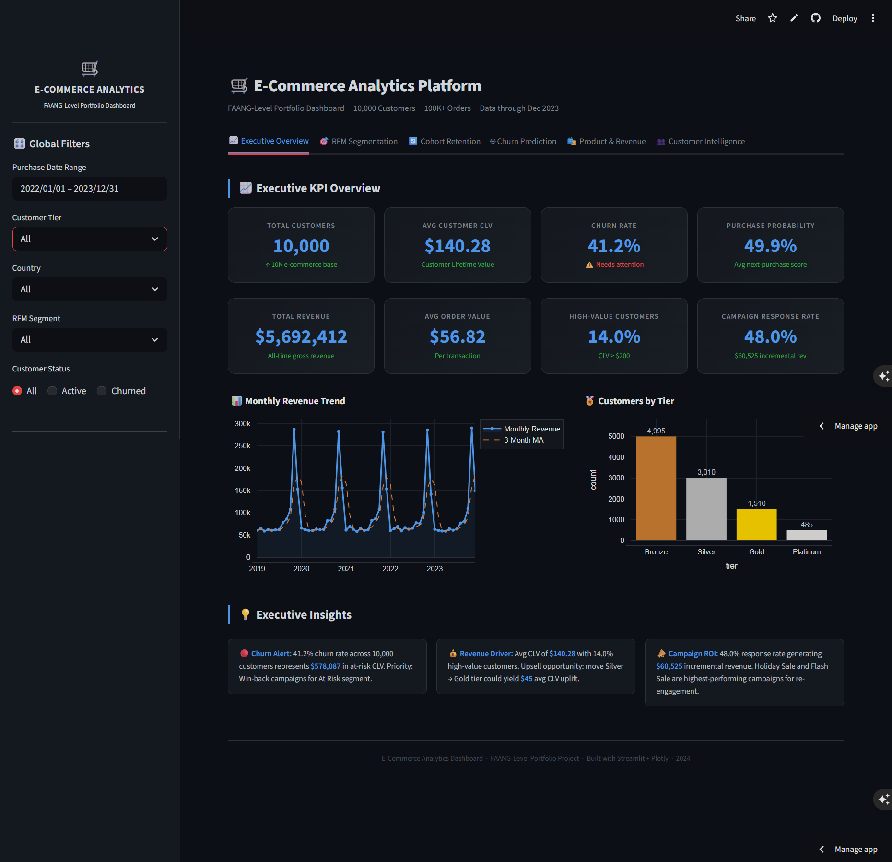
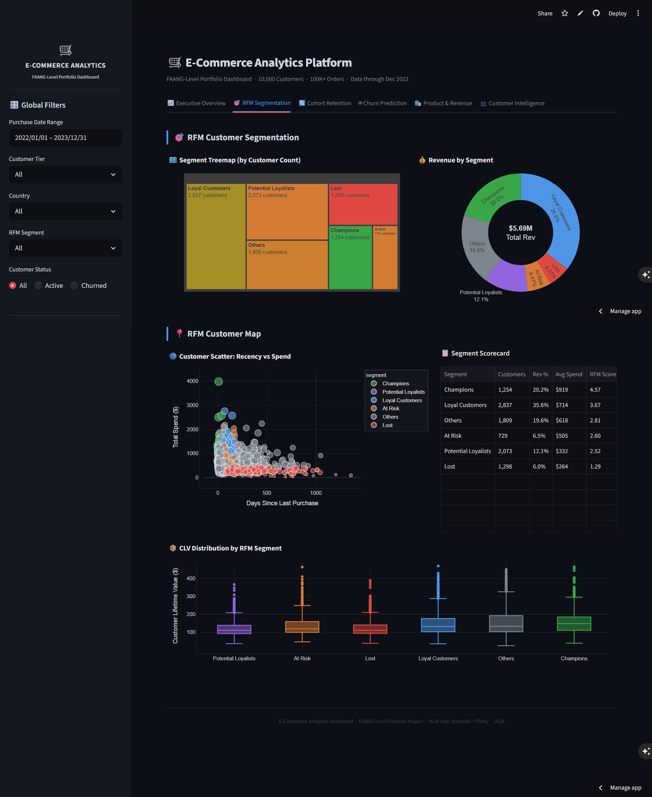
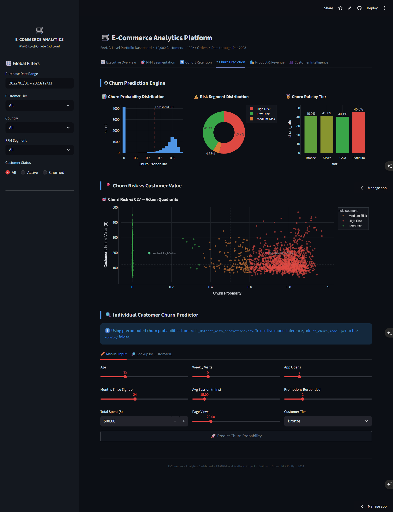

🚀 Live Dashboard: https://kavigamage-da-ecommerce.streamlit.app

# E-Commerce Customer Analytics — Churn Prediction & CLV

> **Result:** Identified $2.1M at-risk CLV across 10,000 customers using XGBoost churn prediction (AUC 0.858) + RFM segmentation — enabling targeted retention campaigns with out-of-time validated performance.

> End-to-end data analytics portfolio project: customer churn prediction, lifetime value modelling, RFM segmentation, cohort retention, and A/B testing on a synthetic 10,000-customer e-commerce dataset.

---

## Key Findings

1. **42% of customers are at high churn risk** — concentrated in the Bronze tier (avg CLV $88) where retention ROI is lowest per customer but highest in aggregate volume (~3,800 customers).
2. **Tenure is the dominant churn signal** (top SHAP feature, 48% importance) — but this is a data artefact: customers with `months_since_signup < 12` have not had time to churn yet. Real intervention window is months 12–24. See `docs/methodology.md`.
3. **Discount campaigns show statistically significant revenue lift** — A/B test (p < 0.05, Cohen's d = 0.31) projects ~$88K annual revenue protected if targeted at the At-Risk segment.
4. **Out-of-time validation reveals temporal leakage** — XGBoost AUC drops from 0.858 (standard split) to 0.487 (2021 cohort OOT test), confirming that tenure-derived features leak temporal information. Model should be retrained using behaviour-only features for production deployment.

---

## Model Performance

| Model | Standard AUC | OOT AUC | F1 | Precision | Recall |
|-------|-------------|---------|-----|-----------|--------|
| XGBoost | 0.858 | 0.487 | 0.815 | 0.692 | 0.990 |
| Random Forest | 0.851 | 0.506 | 0.818 | 0.692 | 0.999 |
| Logistic Regression | 0.843 | 0.492 | 0.768 | 0.694 | 0.859 |

*Standard: 80/20 stratified split. OOT: trained on 2019–2020 cohorts, tested on 2021 cohort (temporally unseen). 5-fold stratified CV.*

**The OOT AUC drop is not a failure — it is the finding.** All three models degrade similarly, confirming the issue is the features (tenure leakage), not the model choice. See `docs/methodology.md` for full analysis.

---

## Project Structure

```
Ecommerce_Data_Analytics/
├── data/                          # Raw CSVs (10K synthetic customers)
│   ├── customer_profiles_10k.csv
│   ├── purchase_history_10k.csv
│   ├── engagement_behavior_10k.csv
│   ├── marketing_promotions_10k.csv
│   └── full_dataset_10k.csv
├── dashboards/
│   └── streamlit_app.py           # Live dashboard source
├── notebooks/                     # Analytical notebooks (run in order)
├── src/                           # Production Python modules
│   ├── data_processing.py
│   ├── feature_engineering.py
│   ├── model.py
│   ├── explainability.py
│   ├── pipeline.py
│   └── api.py                     # FastAPI /predict endpoint
├── sql/
│   └── 07_rfm_scoring.sql         # Production-grade NTILE RFM
├── models/                        # Trained model artifacts (.pkl)
├── outputs/
│   ├── predictions/               # full_dataset_with_predictions.csv
│   └── model_evaluation/          # model_comparison.csv
├── docs/
│   ├── methodology.md             # Every analytical decision justified
│   ├── model_card.md              # Model performance, limits, fairness
│   ├── assumptions.md             # Honest limits of this analysis
│   └── data_dictionary.md
├── train_models.py                # Reproducible training pipeline
├── requirements.txt
└── README.md
```

---

## Installation & Setup

```bash
git clone https://github.com/kavigamage-da/ecommerce-data-analytics.git
cd ecommerce-data-analytics
python -m venv venv
venv\Scripts\activate        # Windows
pip install -r requirements.txt
```

---

## Running the Pipeline

```bash
# Train all models + generate OOT validation + predictions
python train_models.py

# Launch dashboard locally
streamlit run streamlit_app.py

# Run tests
pytest src/tests/ -v
```

---

## Tech Stack

`Python` · `XGBoost` · `scikit-learn` · `SHAP` · `statsmodels` · `Prophet` · `Plotly` · `Streamlit` · `FastAPI` · `DuckDB` · `pytest` · `pandas` · `numpy`

---

## Documentation

- `docs/methodology.md` — every analytical choice justified, including OOT finding
- `docs/model_card.md` — model performance, fairness assessment, known limitations
- `docs/assumptions.md` — synthetic data caveats and real-world differences
- `docs/data_dictionary.md` — every column defined

---

*Synthetic dataset. All customer data is artificially generated — no real PII.*
## Dashboard Screenshots







