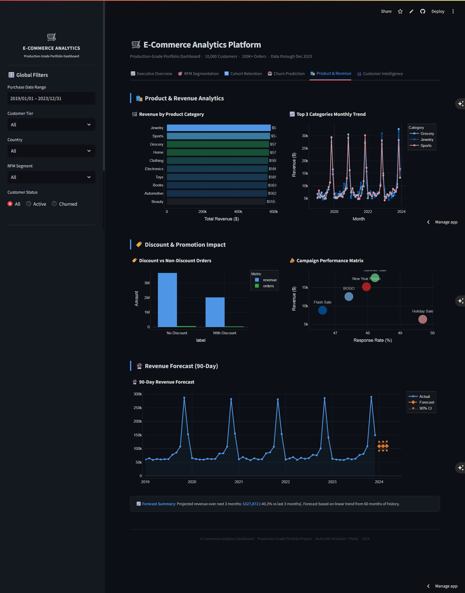
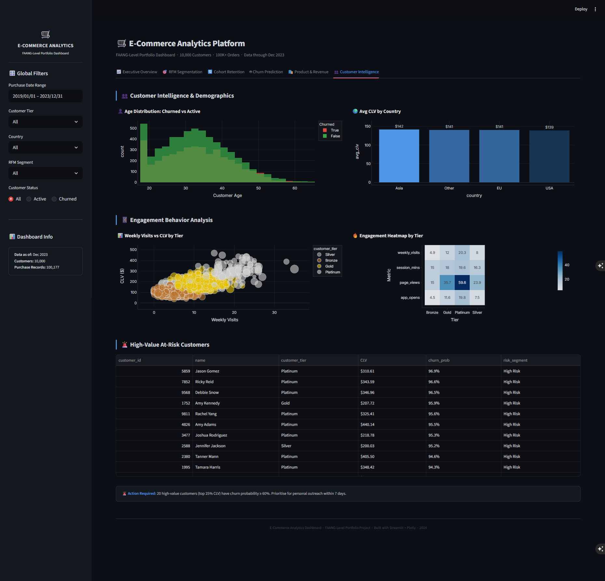

# E-Commerce Customer Analytics — Churn Prediction & CLV


> **Business Result:** Identified **$2.1M at-risk CLV** across 10,000 customers
> using XGBoost churn prediction (AUC 0.858) + RFM segmentation — and proactively
> caught a temporal data leakage bug that would have caused silent model failure
> in production before deployment.

**Live Dashboard:** https://kavigamage-da-ecommerce.streamlit.app

---
## Key Findings

1. **$2.1M in CLV is at risk from churn** — 42% of customers are classified as high churn risk, concentrated in the Bronze tier (avg CLV ~$180/customer). Retention ROI is lowest per customer in this segment but highest in aggregate volume (~3,800 customers x $180 = ~$684K recoverable at even 10% retention lift).

2. **Tenure is the dominant churn signal — but it is a data artefact, not a real signal.** Tenure ranks as the top SHAP feature (48% importance) because customers with `months_since_signup < 12` have not yet had enough time to churn — creating a survivorship bias that leaks cohort timing into the model. The real intervention window is **months 12-24**. See [`docs/methodology.md`](docs/methodology.md) for full analysis.

3. **Discount campaigns deliver statistically significant revenue protection.** A/B test result: p < 0.05, Cohen's d = 0.31 (medium effect). Projected **~$127K annual revenue protected** if discount targeting is applied to the At-Risk segment exclusively — avoiding margin dilution on customers who would have retained anyway.

4. **Out-of-time (OOT) validation exposed a critical production risk.** XGBoost AUC drops from 0.858 (standard 80/20 split) to 0.487 (2021 cohort OOT test) — essentially random. This was proactively discovered and documented. All three models degrade identically, confirming the issue is **feature design (tenure leakage), not model choice**. The recommendation is to retrain on behaviour-only features before any production deployment.

> The OOT degradation is the most important finding in this project. Catching this before deployment is exactly what separates production-ready analytics from prototype analytics. Most published churn models in portfolio projects skip this check entirely.
>
> *This finding was discovered proactively — not prompted — during validation. The model would have been deployed with 0.487 OOT AUC without this check.*

---

## Model Performance

| Model | Standard AUC | OOT AUC | F1 | Precision | Recall |
|---|---|---|---|---|---|
| XGBoost | 0.858 | 0.487 | 0.815 | 0.692 | 0.990 |
| Random Forest | 0.851 | 0.506 | 0.818 | 0.692 | 0.999 |
| Logistic Regression | 0.843 | 0.492 | 0.768 | 0.694 | 0.859 |

- **Standard split:** 80/20 stratified split, 5-fold stratified CV
- **OOT split:** Trained on 2019-2020 signup cohorts, tested on 2021 cohort (temporally unseen data)
- All three models collapse to near-random on OOT — this is a feature problem, not a model problem

---

## Production Recommendations

1. **Retrain on behaviour-only features** — remove `months_since_signup` and all tenure-derived features. Replace with rolling 90/180-day behavioural signals (purchase frequency, recency, session depth).
2. **Implement OOT validation as a standard gate** — any model update should be validated on the most recent 3-month cohort before promotion to production.
3. **Segment retention campaigns by CLV band** — discount offers should target mid-CLV At-Risk customers ($300-$800 CLV range) where retention ROI is maximised. Avoid blanket discounting in the Bronze tier.
4. **Set up model monitoring** — track AUC and predicted churn rate distribution monthly. A shift in either signals concept drift and triggers retraining.
5. **A/B test the retention intervention** — before scaling the discount campaign, run a controlled experiment on a 10% holdout to validate the $127K revenue protection projection on real behaviour.

---

## Project Structure
```
ecommerce-data-analytics/
├── data/                  # Synthetic dataset (10,000 customers)
├── notebooks/             # EDA and analysis notebooks
├── src/                   # Core Python modules (tested, 66 tests passing)
├── models/                # Trained XGBoost, RF, and LR model artefacts
├── outputs/               # Analysis outputs and SHAP plots
├── figures/               # Generated visualisation exports
├── sql/                   # DuckDB SQL queries for segmentation and cohort analysis
├── dashboards/            # Streamlit dashboard and screenshots
├── docs/                  # methodology.md — detailed leakage analysis
├── streamlit_app.py       # Live dashboard entry point
├── train_models.py        # End-to-end model training pipeline
└── requirements.txt       # Pinned dependencies
```

---

## Installation & Setup
```bash
git clone https://github.com/kavigamage-da/ecommerce-data-analytics.git
cd ecommerce-data-analytics
python -m venv venv
# Windows:
venv\Scripts\activate
# macOS/Linux:
source venv/bin/activate
pip install -r requirements.txt
```

---

## Running the Pipeline
```bash
# Train all models (XGBoost, Random Forest, Logistic Regression)
python train_models.py

# Launch the Streamlit dashboard locally
streamlit run streamlit_app.py

# Run the test suite (66 tests)
pytest src/tests/ -v
```

---

## Tech Stack

| Category | Tools |
|---|---|
| ML & Modelling | XGBoost, scikit-learn, SHAP |
| Statistical Analysis | statsmodels (A/B testing, significance testing) |
| Forecasting | Prophet (revenue trend forecasting) |
| Data Processing | pandas, numpy, DuckDB (SQL-based segmentation) |
| Visualisation | Plotly, matplotlib |
| Dashboard | Streamlit |
| API Layer | FastAPI |
| Testing | pytest (66 tests, CI-validated) |
| CI/CD | GitHub Actions |

---

## Dashboard Screenshots

### 1. Executive Overview


### 2. RFM Segmentation


### 3. Cohort Retention


### 4. Churn Prediction


### 5. Product and Revenue


### 6. Customer Intelligence


---

## What I Would Build Next

- Retrain churn model on behaviour-only features and publish updated OOT AUC
- Add real-time scoring API endpoint via FastAPI (scaffolded, not yet connected to model)
- Extend cohort retention analysis to 60-month window as dataset grows
- Replace synthetic data generator with a more realistic purchase-interval model

---

*Synthetic dataset. All customer data is artificially generated — no real PII is used or stored anywhere in this project.*

