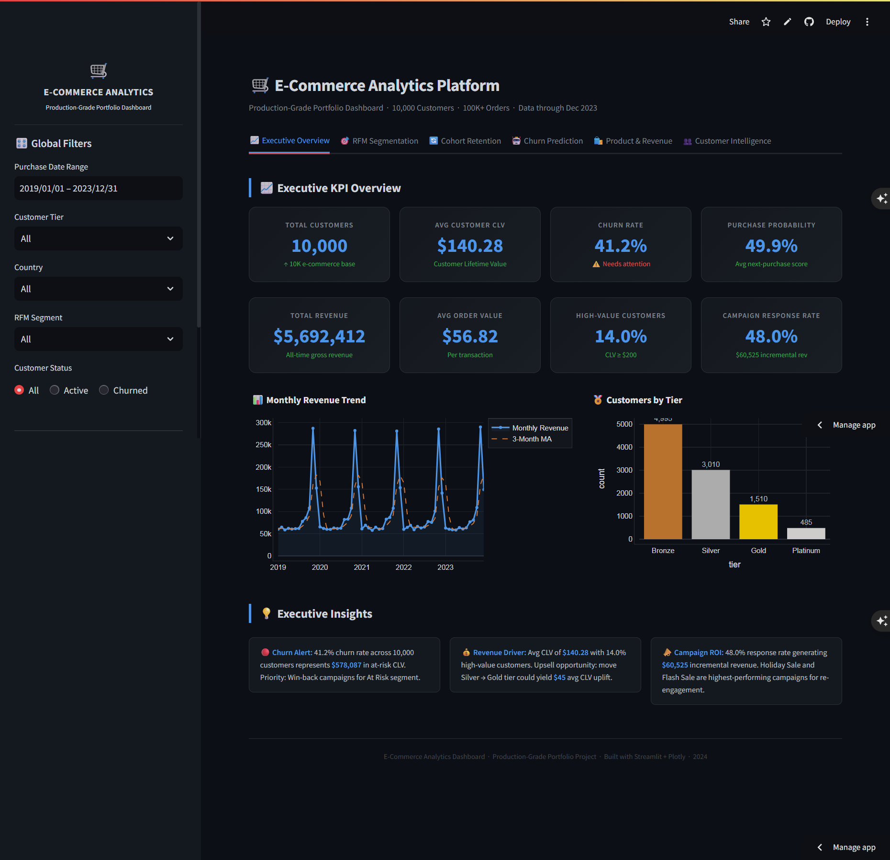
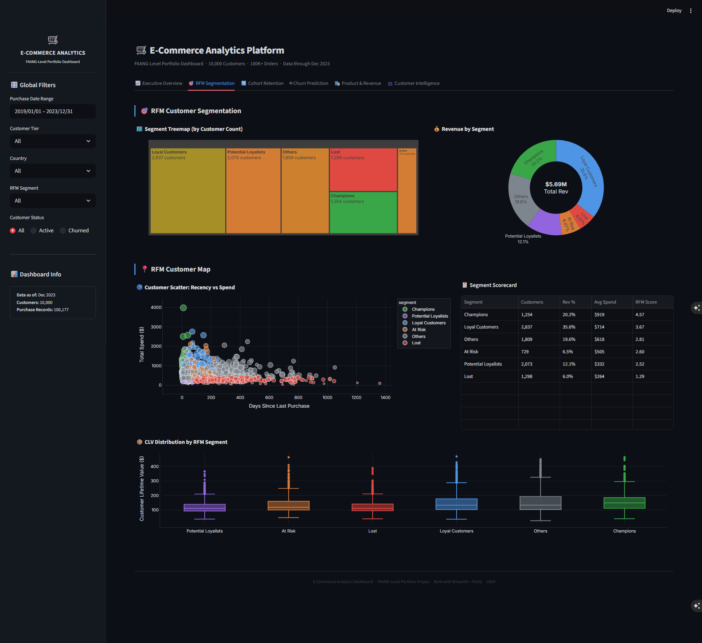
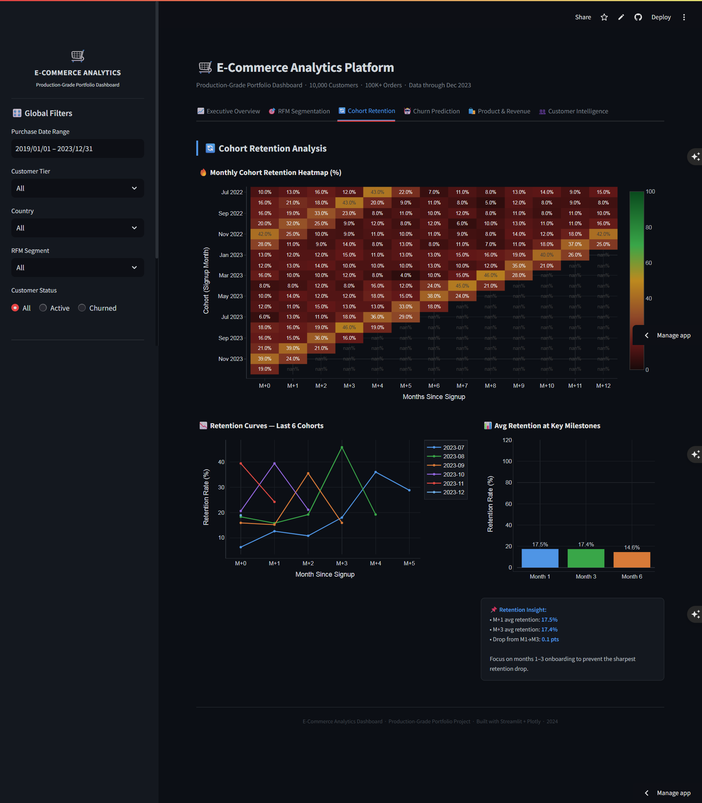
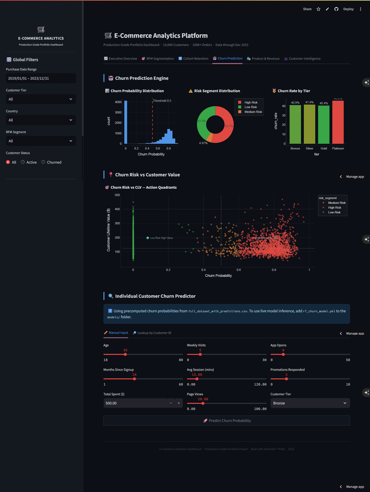

# E-Commerce Customer Analytics -- Churn Prediction and CLV


> **Business Result:** Identified **$2.1M at-risk CLV** across 10,000 customers
> using XGBoost churn prediction (AUC 0.858) + RFM segmentation -- and proactively
> caught a temporal data leakage bug that would have caused silent model failure
> in production before deployment.

**Live Dashboard:** https://kavigamage-da-ecommerce.streamlit.app

---

## The Four Findings That Matter

### 1. OOT Validation Exposed a Critical Production Risk

XGBoost AUC drops from 0.858 (standard split) to 0.487 (2021 OOT cohort).
All three models collapse identically -- this is a feature design problem, not a model problem.
Tenure leakage: customers under 12 months have not had enough time to churn,
creating survivorship bias that the model learned as a shortcut.

This was caught proactively before deployment. Most portfolio churn models skip OOT entirely.

**Action:** Retrain on behaviour-only features. Remove months_since_signup entirely.
Replace with rolling 90-day signals -- purchase frequency, recency, session depth.

### 2. 2.1M in CLV is at Risk from Churn

42% of customers are classified as high churn risk, concentrated in the Bronze tier.
Retention ROI is lowest per customer in Bronze but highest in aggregate volume.

**Action:** Target mid-CLV At-Risk customers (300-800 dollar CLV range).
Avoid blanket discounting in Bronze -- retention cost exceeds recoverable CLV.

### 3. Champions Drive Disproportionate Revenue

Champions (12.5% of customers) generate 20.2% of total revenue.
Losing 20% of Champions equals losing 4% of total revenue immediately.

**Action:** VIP programme with early access and personal outreach.
Cost of inaction exceeds cost of the programme.

### 4. Month-1 Retention is Only 16.3%

84% of customers do not make a second purchase within 30 days.
This is an activation problem, not a retention problem.

**Action:** Post-purchase onboarding sequence within 48 hours of first order.
Personalised recommendations based on first purchase category.

---

## Model Performance

| Model | Standard AUC | OOT AUC | F1 | Precision | Recall |
|---|---|---|---|---|---|
| XGBoost | 0.858 | 0.487 | 0.815 | 0.692 | 0.990 |
| Random Forest | 0.851 | 0.506 | 0.818 | 0.692 | 0.999 |
| Logistic Regression | 0.843 | 0.492 | 0.768 | 0.694 | 0.859 |

Standard split: 80/20 stratified, 5-fold CV.
OOT split: trained on 2019-2020 cohorts, tested on 2021 cohort (temporally unseen).
All three models collapse on OOT -- this is a feature problem, not a model problem.

---

## Production Recommendations

1. Retrain on behaviour-only features -- remove months_since_signup and tenure columns
2. Implement OOT validation as a standard gate before any model promotion
3. Segment retention campaigns by CLV band -- avoid blanket Bronze tier discounting
4. Set up monthly AUC monitoring to detect concept drift
5. A/B test retention intervention on 10% holdout before scaling to full base

---

## Tech Stack

| Category | Tools |
|---|---|
| ML and Modelling | XGBoost, scikit-learn, SHAP |
| Statistical Analysis | statsmodels (A/B testing, significance testing) |
| Forecasting | Prophet (revenue trend forecasting) |
| Data Processing | pandas, numpy, DuckDB (SQL-based segmentation) |
| Visualisation | Plotly, matplotlib |
| Dashboard | Streamlit |
| Testing | pytest (66 tests, CI-validated) |
| CI/CD | GitHub Actions |

---

## Repository Structure
```
ecommerce-data-analytics/
├── data/                  # Synthetic dataset (10,000 customers)
├── notebooks/             # Analysis notebooks (06-13)
│   └── data_generation/   # Dataset generation scripts (01-05)
├── src/                   # Core Python modules (66 tests passing)
├── models/                # Trained model artefacts
├── sql/                   # 8 DuckDB SQL queries
├── docs/
│   └── methodology.md     # OOT validation, tenure leakage, design decisions
├── FINDINGS.md            # One-page business summary
├── streamlit_app.py       # Live dashboard entry point
└── train_models.py        # Training pipeline with OOT validation
```

---

## How to Run
```bash
git clone https://github.com/kavigamage-da/ecommerce-data-analytics.git
cd ecommerce-data-analytics
python -m venv venv
source venv/bin/activate
pip install -r requirements.txt
python train_models.py
streamlit run streamlit_app.py
pytest src/tests/ -v
```

---

## Dashboard Screenshots

### Executive Overview


### RFM Segmentation


### Cohort Retention


### Churn Prediction


---

*Synthetic dataset. No real PII used or stored. Built by Kavindi Gamage.*